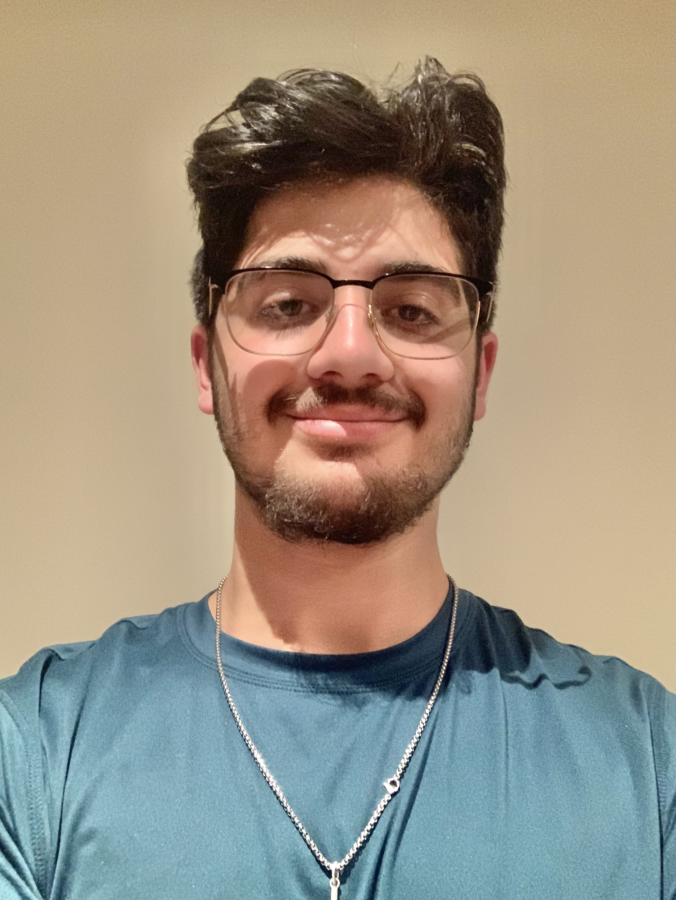
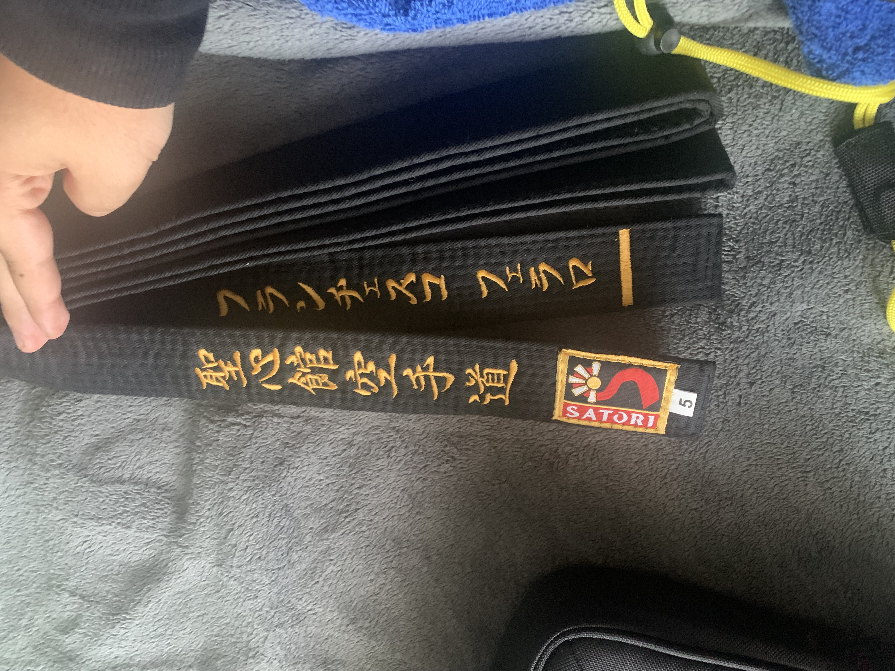

<!DOCTYPE html>
<html lang="en">
<head>
    <meta charset="UTF-8" />
    <meta name="viewport" content="width=device-width, initial-scale=1.0" />
    <title>Francesco Ferraro | Personal Website</title>

    
</head>

<body>

    <!-- NAVIGATION -->
    <nav>
        <ul>
            <li><a href="#home">Home</a></li>
            <li><a href="#about">About</a></li>
            <li><a href="#hobbies">Hobbies</a></li>
            <li><a href="#achievements">Achievements</a></li>
            <li><a href="#projects">Projects</a></li>
            <li><a href="#socials">Socials</a></li>
            <li><a href="#contact">Contact</a></li>
        </ul>
    </nav>

    <!-- HEADER / HOME -->
    <header id="home">
        <!-- Your real profile picture -->
        
        <h1>Francesco Ferraro</h1>
        
York University Student • Aspiring Teacher • 2nd Degree Black Belt

    </header>

    

        <!-- ABOUT -->
        <section id="about">
            <h2>About Me</h2>
            

                Hi! My name is <strong>Francesco Ferraro</strong>, and I'm a current student at
                <strong>York University</strong>. I’m passionate about becoming a future teacher and creating a positive,
                supportive learning environment for students. Education inspires me, and my goal is to guide future students
                the same way my own teachers motivated me.
            

        </section>

        <!-- HOBBIES -->
        <section id="hobbies">
            <h2>Hobbies & Skills</h2>
            <ul>
                <li><strong>Soccer</strong> — my favorite sport to play and watch.</li>
                <li><strong>Video Games</strong> — a fun way to relax and connect.</li>
                <li><strong>Karate</strong> — I am a <strong>2nd degree black belt</strong>, achieved through years of dedication.</li>
                <li><strong>Streaming</strong> — I enjoy gaming and interacting with viewers.</li>
            </ul>
        </section>

        <!-- ACHIEVEMENTS -->
        <section id="achievements">
            <h2>Achievements</h2>
            <ul>
                <li><strong>Co-op Placement at an Elementary School (Grades 11 & 12)</strong>  
                    - Assisted teachers, worked with students, and gained real classroom experience.
                </li>
                <li>2nd Degree Black Belt in Karate — discipline, leadership, and commitment.</li>
            </ul>

            <!-- Your karate belt image placed here -->
            
        </section>

        <!-- PROJECTS -->
        <section id="projects">
            <h2>Projects</h2>
            

                One of my creative hobbies is making fun shapes or designs using old cans.  
                I enjoy turning something simple like empty Monster cans into unique little creations.
            

            <!-- Monster can structure image -->
            
        </section>

        <!-- SOCIALS -->
        <section id="socials">
            <h2>Socials & Contact Info</h2>
            <ul>
                <li><strong>Email (YorkU):</strong> <a href="mailto:fmf2007@my.yorku.ca">fmf2007@my.yorku.ca</a></li>
                <li><strong>Instagram:</strong> <a href="https://instagram.com/fmferraro10" target="_blank">@fmferraro10</a></li>
                <li><strong>Twitch:</strong> <a href="https://twitch.tv/XDFallenlegacy" target="_blank">XDFallenlegacy</a></li>
                <li><strong>Online Username:</strong> Fmferraro10</li>
            </ul>
        </section>

        <!-- CONTACT FORM -->
        <section id="contact">
            <h2>Contact Me</h2>
            
You can send me a message below:

            <form>
                <input type="text" placeholder="Your Name" required />
                <input type="email" placeholder="Your Email" required />
                <textarea rows="4" placeholder="Your Message" required></textarea>
                <button type="submit">Send Message</button>
            </form>
        </section>

    

    

        © 2025 Francesco Ferraro — All Rights Reserved  
    

</body>
</html>
